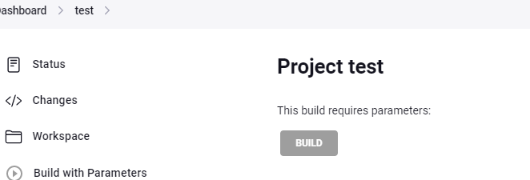
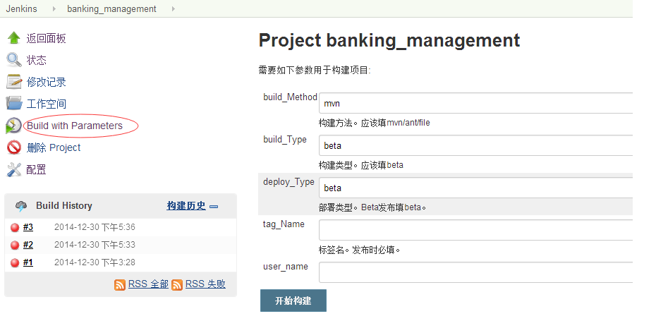

# Hidden Parameter Plugin

[](https://ci.jenkins.io/job/Plugins/job/hidden-parameter-plugin/job/main/)
[](https://ci.jenkins.io/job/Plugins/job/hidden-parameter-plugin/job/main)
[](https://ci.jenkins.io/job/Plugins/job/hidden-parameter-plugin/job/main)
[](https://plugins.jenkins.io/hidden-parameter)
[](https://github.com/jenkinsci/hidden-parameter-plugin/releases/latest)
[](https://github.com/jenkinsci/hidden-parameter-plugin/blob/main/LICENSE)
[](https://plugins.jenkins.io/hidden-parameter)

Provide `hidden` parameter to Jenkins Jobs. Similar to `string` parameter but not displayed on the UI when triggering the jobs. 

Useful when administrators want to enforce some parameters/variables to jobs

## Examples

In freestyle jobs


Parameter is not visible on the UI



Parameter is set for the job



## Pipeline support

```
parameters {
    hidden(name: 'hidden_param', defaultValue: 'hidden_value', description: 'Hidden parameter')
}
```

## JobDSL support

```
parameters {
    hidden {
        name('param_hidden')
        defaultValue('hidden_value')
        description('Hidden parameter')
    }
}
```
